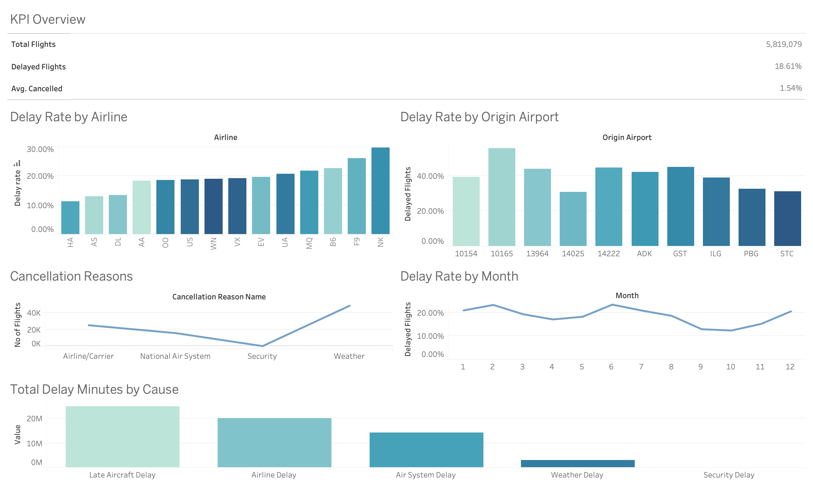
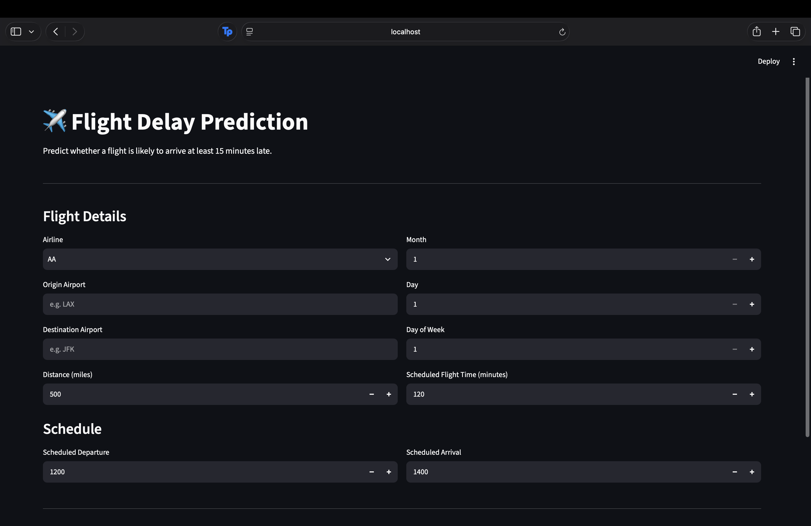
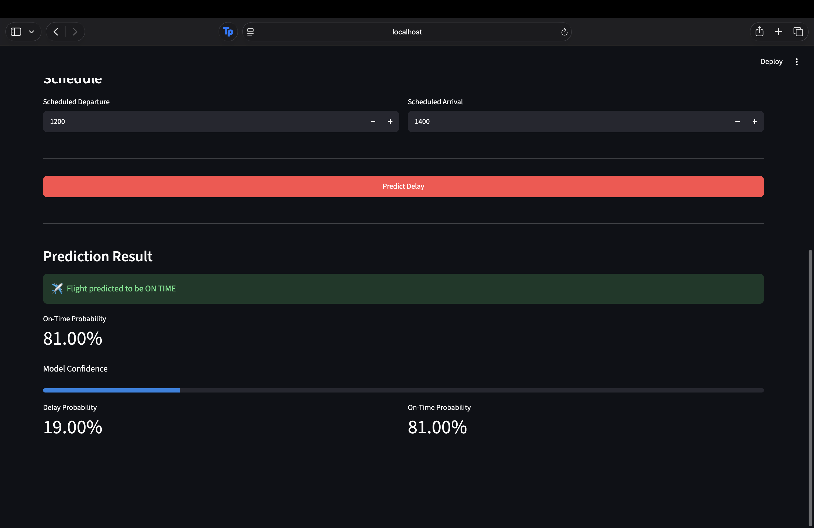

# Flight Delay Prediction and Airport Operational Analytics

## Overview

### Tableau Dashboard



### Streamlit Application



### Streamlit Application Prediction 



An end-to-end data science project that analyzes flight operations and predicts whether a flight will arrive at least 15 minutes late.

The project combines **Python, Machine Learning, PostgreSQL, SQL, Tableau, and Streamlit** to build a complete analytics and prediction system.

## Project Objectives

- Analyze flight delay and cancellation patterns.
- Identify airlines, airports, routes, and periods with higher delay rates.
- Analyze major causes of flight delays.
- Build a machine learning model to predict flight delays.
- Develop an interactive dashboard for operational analytics.
- Build a Streamlit interface for real-time flight delay prediction.

## Tech Stack

- **Python**
- **Pandas & NumPy**
- **Scikit-learn**
- **SciPy**
- **PostgreSQL**
- **SQL**
- **Tableau**
- **Streamlit**
- **Jupyter Notebook**
- **Joblib**

## Dataset

The project uses the **2015 US Flight Delays and Cancellations** dataset.

The dataset contains information about:

- Airlines
- Origin and destination airports
- Scheduled flight times
- Flight distance
- Arrival and departure delays
- Cancellations
- Cancellation reasons
- Delay causes

The PostgreSQL database contains approximately **5.8 million flight records**.

## Machine Learning

### Target

A flight is classified as delayed when:

```text
Arrival Delay >= 15 minutes


Features
The model uses pre-flight information such as:
- Month
- Day
- Day of Week
- Airline
- Origin Airport
- Destination Airport
- Scheduled Departure
- Scheduled Arrival
- Scheduled Flight Time
- Distance
Post-flight information such as actual arrival delay is not used as an input feature in order to avoid data leakage.
Models
Two models were evaluated:
- Logistic Regression
- Random Forest Classifier
The Random Forest model achieved approximately:
- Accuracy: 74.4%
- Precision: 68.0%
- Recall: 53.0%
- F1 Score: 59.6%
- ROC-AUC: 0.787
The Random Forest model was selected for the Streamlit prediction application.
PostgreSQL & SQL Analytics
The complete flight dataset was imported into PostgreSQL for large-scale analytical queries.
SQL analysis includes:
- Total flight volume
- Airline delay rates
- Origin airport delay rates
- Destination airport delay rates
- Route delay rates
- Monthly delay trends
- Day-of-week delay trends
- Airline cancellation rates
- Cancellation reasons
- Delay causes
- Departure vs arrival delay comparison
These queries provide operational insights that complement the machine learning predictions.
Tableau Dashboard
An interactive Tableau dashboard was created to visualize the operational analysis.
The dashboard includes:
- Total Flights
- Overall Delay Rate
- Cancellation Rate
- Delay Rate by Airline
- Delay Rate by Month
- Delay Rate by Day of Week
- Top Origin Airports by Delay Rate
- Top Destination Airports by Delay Rate
- Busiest Routes and Their Delay Rates
- Cancellation Reasons
- Major Delay Causes
- Departure vs Arrival Delay Recovery
Streamlit Application
A Streamlit web application provides an interactive interface for predicting flight delays.
Users can enter:
- Airline
- Origin Airport
- Destination Airport
- Flight distance
- Month
- Day
- Day of Week
- Scheduled Departure
- Scheduled Arrival
- Scheduled Flight Time
The application returns:
- Predicted outcome
- Delay probability
- On-time probability
- Model confidence
Project Architecture
                    Flight Dataset
                          │
             ┌────────────┴────────────┐
             │                         │
          Python                   PostgreSQL
             │                         │
      Data Preparation            SQL Analytics
             │                         │
       Machine Learning              │
             │                       │
       Random Forest                 │
             │                       │
             └───────────┬───────────┘
                         │
                 Analytics & Insights
                         │
              ┌──────────┴──────────┐
              │                     │
           Tableau              Streamlit
          Dashboard           Prediction App

Project Structure
flight-delay-prediction/
│
├── data/
│   └── raw/
│       └── *.csv
│
├── models/
│   ├── encoder.pkl
│   ├── scaler.pkl
│   └── rf_model.zip
│
├── notebooks/
│   └── 01_data_exploration.ipynb
│
├── sql/
│   └── 01_basic_queries.sql
│
├── app.py
├── requirements.txt
├── README.md
└── .gitignore

How to Run
1. Clone the repository
git clone https://github.com/AdityaUpadhyay00/flight-delay-prediction.git
cd flight-delay-prediction

2. Create a virtual environment
python -m venv .venv

3. Activate the virtual environment
macOS/Linux:
source .venv/bin/activate

Windows:
.venv\Scripts\activate

4. Install dependencies
pip install -r requirements.txt

5. Extract the trained model
The trained Random Forest model is stored as a compressed ZIP file because the original model exceeds GitHub's recommended file size.
From the project root:
unzip models/rf_model.zip -d models/

This creates:
models/rf_model.pkl

6. Run the Streamlit application
streamlit run app.py

The application will open in your browser.
Key Skills Demonstrated
- Data Cleaning & Preprocessing
- Exploratory Data Analysis
- Feature Engineering
- One-Hot Encoding
- Feature Scaling
- Train/Test Splitting
- Handling Class Imbalance
- Logistic Regression
- Random Forest
- Classification Metrics
- Confusion Matrix
- ROC-AUC Analysis
- Feature Importance
- SQL Analytics
- PostgreSQL
- Data Visualization
- Tableau Dashboard Development
- Streamlit Application Development
- Git & GitHub
- End-to-End Data Science Workflow